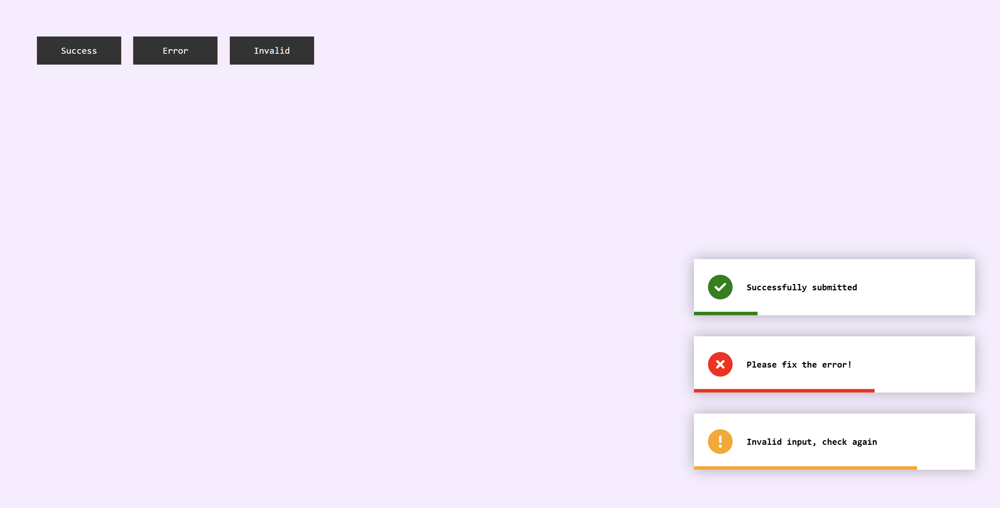

# 🔔 Toast Notification Website

A simple and elegant **Toast Notification** system built using **HTML**, **CSS**, and **JavaScript**. Easily trigger quick alerts/messages to inform users about various actions.

## 📸 Screenshot 🖼️


## ✨ Features
- 🔔 Stylish toast alerts for success, error, warning, and info
- ⏳ Auto-dismiss after a set time
- 🖥️ Responsive and lightweight design
- 🎨 Easily customizable styles and messages

## 🛠️ Technologies Used
- 🏗️ **HTML** – Markup structure
- 🎨 **CSS** – Styling and animations
- ⚡ **JavaScript** – Dynamic behavior and DOM interaction

## 📂 Project Structure
```
📁 toast-notification/
│-- 📄 index.html       (Main HTML file)
│-- 📄 style.css        (CSS for styles and animations)
│-- 📄 README.md        (Project documentation)
│-- 📄 dashboard.png   (Project screenshot)
```

## 📥 Installation & Usage
1. Clone the repository:
   ```bash
   git clone https://github.com/shelavalepallavi/toast-notification.git
   ```
2. Navigate to the project folder:
   ```bash
   cd toast-notification
   ```
3. Open `index.html` in your browser.

## 🎯 How to Use
1. 🔘 Click the trigger buttons to show different types of notifications.
2. ⏳ Toast will disappear after a few seconds.

## 💡 Customization Ideas
- Change toast position (top-left, top-right, bottom, etc.)
- Modify duration for different types
- Add sound/vibration support
- Queue multiple toasts

## 🤝 Contributing
Pull requests and feature suggestions are welcome! Please fork the repo and submit your ideas.
